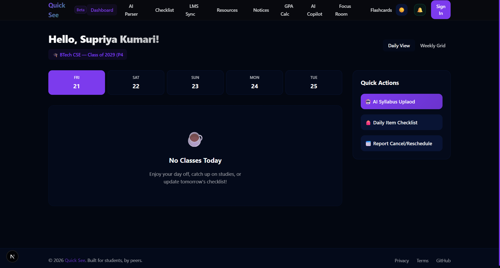
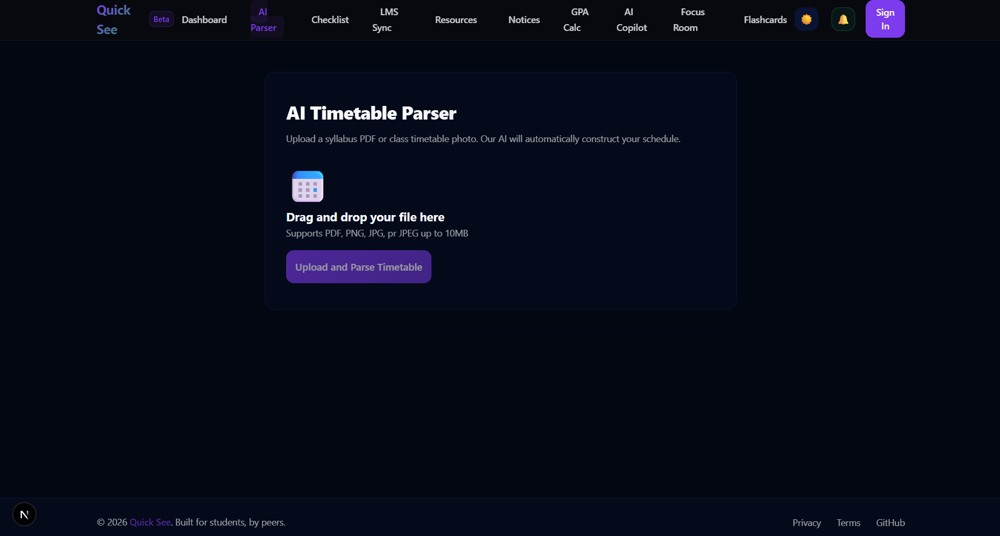
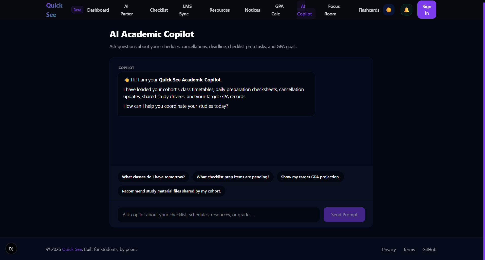
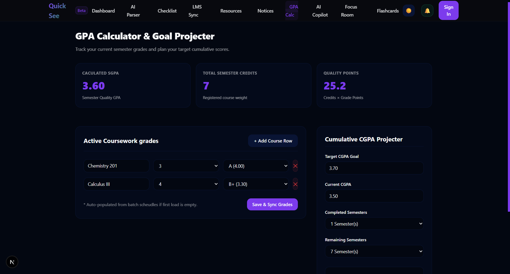
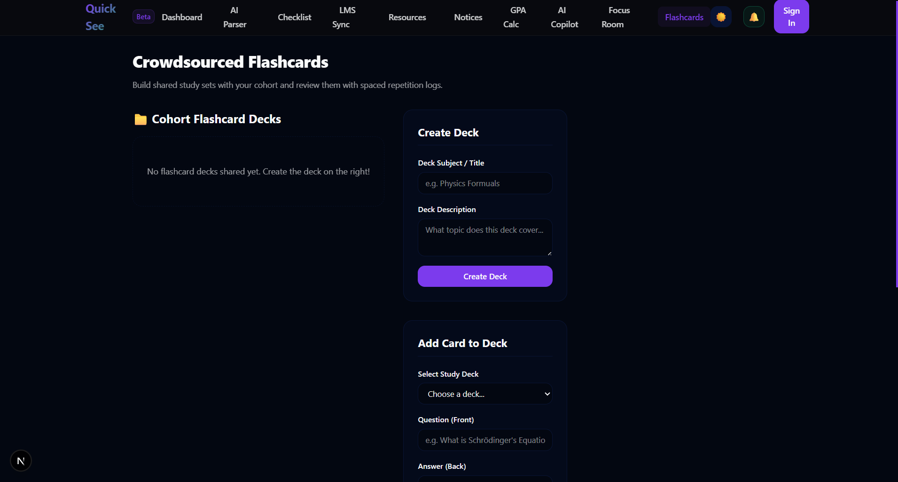

# Quick_See 

## Overview
An intelligent, crowdsourced academic management co-pilot built to take the pain out of managing university schedules. Instead of manually entering classes, deadlines, and exam dates into your calendar, you just upload syllabus or timetable and let the AI build your calendar.

Furthermore, it syncs updates-like cancellations or reschedules-in real-time across your entire class cohort. It also features a nightly notification helper that check tomorrow's timetable and peer checklists to tell you exactly what physical books, notes, lab gear you need to pack for the next day.

## Features
**AI-Powered Timetable Parser:** Drag and drop an image or PDF of your university timetable. The app extracts lectures, timings, rooms, and instructors instantly.
**Real-Time Schedule Sync:** Class representatives can post cancellations or reschedules, which instantly update the calendar dashboards of all batch mates in real-time.
**Crowdsourced Material Checklist:** Share preparation checksheets for courses(e.g. "Wear lab coat). Peer moderation filters out duplicate or incorrect entries.
**Nightly Pack-Your-Bag Alert:** Receives push notifications and email summaries at 9:00 PM listing tomorrow's schedule and what to pack.
**LMS Portal Sync:** Connects with Canvas, Moodle, and Blackboard sandbox credentials to pull deadlines and sync assignments straight into your cohort checklist.
**Cohort Study Material Drive:** Category-organized repository (Lecture Notes, Slides, Past Papers) with peer upvoting and live countdown cards ticking down to midterms/finals.
**Class Notice Board & Polls:** Share cohort announcements (pin notices to top of feed) and host scheduling polls with real-time percentage indicators.
**GPA Calculator & Projection:** Auto-populates active courses from your timetable to calculate SGPA, combined with a goal projection widget estimating grades needed in remaining semesters.
**AI Academic Copilot:** A chat assistant fed with all your batch databases (timetables, resources, checklists, GPA goals) to act as a custom academic planner.
**Peer Study Rooms & Pomodoro Timer:** Schedule co-working sessions, track attendee seat capacities, and study together using the interactive Pomodoro academic planner.
**Flashcards Hub:** Create shared flashcard decks with 3D card flips and study queues that loop difficult cards until mastered.

## Known Bugs
**SW Active Timing Race:** Notification subscriptions may ocassionally fail if requested immediately before the service worker reaches an active state.
**Framer Motion Grid Shifts:** Rapid status toggles on the focus countdowns or Pomodoro clock may trigger minor, temporary pixel layout shifts.
**Chrome extension CSP Warning:** A harmless Content Security Policy warning may appear in your console due to Chrome extensions attempting to hook into the localhost.
**Theme Toggle Flicker:** Persisting theme states via localStorage can cause a brief flash or light-mode styling on high-speed page reloads.

## Tech Stack
#### Frontend:

- Next,js (App Router) with TypeScript
- Tailwind CSS (Theme layout & Styles)
- Framer Motion (Transactions & animations)
- Zustand (Global States)
- Service Worker API (Background push)

#### Backend:

- Supabase (PostgreSQL database, Realtime channels, Auth, Stoarge)
- Google Gemini 2.5 Flash API (AI parsing & Copilot chat)
- web-push SDK (VAPID notification dispatching)

## How to use?
1. **Onboarding Cohort:** Sign up and choose your University, Campus, Department, and Batch. If they don't exist, create them to setup your new class cohort.
2. **Parse Timetable:** Navigate to "AI Parser" and drop your timetable file. Review the extracted lectures and click "Confirm & Import".
3. **Plan Checklists:** Head to "Checklist" to add items or look up peer attachments.
4. **Utilize Study Tools:** Open the GPA calculator, Pomodoro focus room, or Flashcards hub to track your milestones.

## How to run locally
1. Clone the repository: `git clone https://github.com/kumarisupriya-dev/Quick_See`
2. Install dependencies in the frontend folder: `npm install`
3. Environment Configuration: Crate a `.env.local` file inside the `frontend` root: ```env
   NEXT_PUBLIC_SUPABASE_URL=your_supabase_project_url
   NEXT_PUBLIC_SUPABASE_ANON_KEY=your_supabase_anon_client_key
   SUPABASE_SERVICE_ROLE_KEY=your_supabase_service_role_key
   GEMINI_API_KEY=your_google_gemini_api_key
   NEXT_PUBLIC_VAPID_PUBLIC_KEY=your_vapid_public_key
   VAPID_PRIVATE_KEY=your_vapid_private_key
   CRON_SECRET=your_nightly_cron_authorization_key```

4. Run development server: `npm run dev`

## AI Usage
- **Initial Setup**
- **Troubleshooting & UI Bugs**
- **Complex Architecture**

## Future Plan 
- **Native Mobile Apps:** Port the React frontend using React Native for native Android and iOS push experiences.
- **AI Study Summarizer:** Feed uploaded lecture notes directly to Gemini to generate flashcard decks automatically.
- **Social Timetable Sharing:** Allow publishing of focus room to other departments.

## Screenshots of Project




